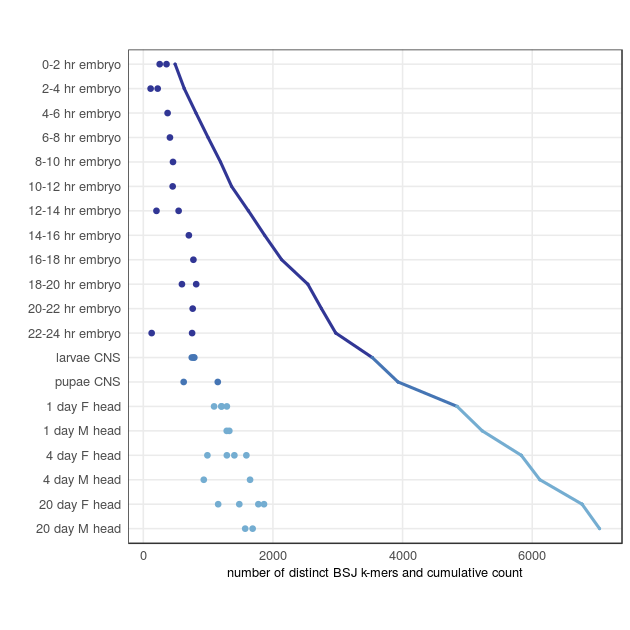

# BIQ manuscript: data processing and figures

This repository contains the data and scripts for recreating the numbers and figures from the manuscript.

## Indexing the transcriptome datasets

Download and install [KIQ](https://github.com/pmenzel/kiq).

The SRA IDs for the Drosophila and ENCODE datasets are in the files `kiq_datasets_fly.tsv` and `kiq_datasets_ENCODE.tsv`,
and the corresponding metadata are in the files `metadata_fly.tsv` and `metadata_ENCODE.tsv`, respectively.

The dataset lists also contain the line `_LINEAR cdna.fa`, to include linear isoforms for filtering possible false positive BSJ k-mers.
The cDNA sequences can be downloaded from the Ensembl FTP server:
```
ftp://ftp.ensembl.org/pub/current_fasta/drosophila_melanogaster/cdna/Drosophila_melanogaster.BDGP6.cdna.all.fa.gz
ftp://ftp.ensembl.org/pub/current_fasta/homo_sapiens/cdna/Homo_sapiens.GRCh38.cdna.all.fa.gz
```

### FLY dataset
```
kiq index -i index_fly.bin -k kiq_db_fly.bin -l kiq_bsj_fly.txt
kiq sra -i index_fly.bin -k kiq_db_fly.bin -l kiq_datasets_fly.tsv -z 10 -v
kiq dump -i index_fly.bin -k kiq_db_fly.bin -p long > kiq_dump_fly.tsv
```
### ENCODE dataset
```
kiq index -i index_encode.bin -k kiq_db_encode.bin -l kiq_bsj_encode.txt
kiq sra -i index_encode.bin -k kiq_db_encode.bin -l kiq_datasets_ENCODE.tsv -z 10 -v
kiq dump -i index_encode.bin -k kiq_db_encode.bin -p long > kiq_dump_ENCODE.tsv
```

## Manuscript figures
R code for creating figures and supplementary figures is also contained in [figures.R](figures.R).


```r
library(tidyverse)
library(reshape2)
library(umap)
library(patchwork)
library(scales)

file_fly_biq_dump <- "./kiq_dump_fly.tsv.gz"
file_fly_exps <- "./metadata_fly.tsv"
file_encode_biq_dump <- "kiq_dump_ENCODE.tsv.gz"
file_encode_exps <- "./metadata_ENCODE.tsv"
```

### FLY
#### Read data

```r
fly.exps <- read_tsv(file_fly_exps)
names(fly.exps) <- make.names(names(fly.exps))
fly.exps <- rename(fly.exps, ID = SRA.id)

fly.dump <- read_tsv(file_fly_biq_dump, col_names = c("kmer", "ID", "count", "rpm"))
# filter out kmers that occur in cDNAs:
linear_kmers <- fly.dump %>% filter(ID == "_LINEAR") %>% pull(kmer)
fly.dump <- fly.dump %>% filter(!kmer %in% linear_kmers)
```

Number of k-mers also found in linear transcripts:

```r
length(linear_kmers)
```

```
## [1] 8
```
Number of counted k-mers:

```r
fly.dump %>% summarize(totalcount = sum(count)) %>% pull(totalcount)
```

```
## [1] 301640
```
Number of unique k-mers found across all samples:

```r
fly.dump %>% pull(kmer) %>% sort %>% unique %>% length
```

```
## [1] 9150
```

#### Figure 2a
UMAP dimension reduction

```r
m <- acast(fly.dump, ID ~ kmer, value.var = "rpm", fill = 0.0)
set.seed(12222213)
umap <- umap(m)
df.umap <- as.data.frame(umap$layout)
colnames(df.umap) <- c("Dim1", "Dim2")
df.umap$ID <- rownames(df.umap)
df.join <- df.umap %>%
  inner_join(fly.exps, by = "ID") %>%
  mutate(cell_line = ifelse(str_detect(group, "BG3|CME|S1|S2|Kc167"), TRUE, FALSE)) %>%
  mutate(coarse_group = case_when(
    str_detect(group, "whole embryo") ~ "whole embryo",
    str_detect(group, "CNS") ~ "larvae / pupae CNS",
    str_detect(group, "head") ~ "head",
    str_detect(group, "ovaries|testes") ~ "ovaries / testes",
    str_detect(group, "digestive") ~ "digestive",
    str_detect(group, "gut") ~ "gut",
    str_detect(group, "carcass") ~ "carcass",
    cell_line == TRUE ~ "cell line",
    TRUE ~ "other"
  ))
blues <- brewer_pal(palette = "RdYlBu")(11)[9:11]
acc <- brewer_pal(palette = "Accent")(8)
plot.cols <- c(
  "whole embryo" = blues[3], "larvae / pupae CNS" = blues[2], "head" = blues[1], "other" = acc[8],
  "ovaries / testes" = acc[1], "digestive" = acc[3], "gut" = acc[7], "cell line" = acc[6], "carcass" = acc[2]
)
lvls <- c("whole embryo", "larvae / pupae CNS", "head", "carcass", "digestive", "gut", "ovaries / testes", "other", "cell line")
p.umap <- ggplot(df.join) +
  geom_point(aes(x = Dim1, y = Dim2, color = fct_relevel(coarse_group, lvls))) +
  xlab("") +
  ylab("") +
  theme_bw() +
  scale_x_continuous(position = "top") +
  scale_color_manual(values = plot.cols) +
  xlab("Dimension 1") +
  ylab("Dimension 2") +
  theme(
    legend.justification = c(1, 0),
    legend.position = c(1, 0),
    legend.title = element_blank(),
    legend.background = element_blank(),
    legend.box.background = element_rect(colour = "black"),
    legend.key.height = unit(11, "pt")
  ) +
  theme(
    panel.grid = element_blank(),
    axis.title = element_text(size = rel(0.8)),
    axis.ticks = element_blank(),
    axis.text = element_blank()
  ) +
  guides(color = guide_legend(ncol = 1)) +
  theme(aspect.ratio = 1)
```

#### Figure 2b
RPM plot over time, as in Westholm2014 Figure 7a

```r
timepoints <- fly.exps %>%
  filter(str_detect(description, "after egg laying")) %>%
  mutate(time = ordered(str_replace(description, "embryos, (.+) hr after egg laying", "\\1"))) %>%
  separate(time, c("starttime", "endtime"), sep = "-", remove = FALSE) %>%
  mutate(endtime = as.integer(endtime), time = fct_reorder(time, endtime), time = factor(paste(time, "hr embryo"))) %>%
  pull(time)

df.plot <- fly.dump %>%
  inner_join(fly.exps, by = "ID") %>%
  filter(group == "whole embryo" | str_detect(group, "heads|CNS")) %>%
  mutate(label = case_when(
    str_detect(description, "CNS") ~ paste(tolower(str_extract(description, "(?i)larvae|pupae")), "CNS"),
    str_detect(description, "after egg laying") ~ paste(str_extract(description, "\\d+\\-\\d+"), "hr embryo"),
    str_detect(description, "female.*day") ~ paste(str_extract(description, "\\d+ day"), "F head"),
    str_detect(description, "male.*day") ~ paste(str_extract(description, "\\d+ day"), "M head"),
    TRUE ~ "NA"
  )) %>%
  mutate(label = factor(label, levels = rev(c(as.character(unique(timepoints)), "larvae CNS", "pupae CNS", "1 day F head", "1 day M head", "4 day F head", "4 day M head", "20 day F head", "20 day M head")))) %>%
  group_by(label, ID, raw_reads) %>%
  summarise(n = n()) %>%
  mutate(coarse_group = case_when(
    str_detect(label, "embryo") ~ "whole embryo",
    str_detect(label, "CNS") ~ "larvae / pupae CNS",
    str_detect(label, "day") ~ "head"
  )) %>%
  mutate(jpm = n / raw_reads * 1e6)

p.rpm <- df.plot %>%
  ggplot() +
  geom_point(aes(y = label, x = jpm, color = coarse_group)) +
  scale_colour_manual(values = plot.cols, guide = FALSE) +
  scale_x_continuous(position = "top") +
  theme_bw() +
  theme(panel.grid.minor.x = element_blank(), axis.title.x = element_text(size = rel(0.8)), axis.ticks = element_blank()) +
  ylab("") +
  xlab("BSJ k-mers / million reads") +
  theme(aspect.ratio = 1)
```

#### Figure 2
Combine Figure 2 a and b

```r
p.umap + labs(tag = "a") + p.rpm + labs(tag = "b") + plot_annotation(tag_levels = "a")
```


#### Suppl Figure 1a
Cumulative number of unique k-mers across all samples

```r
fly.dump$ID <- reorder(fly.dump$ID, fly.dump$ID, FUN = length)

df.fly.cumulative_kmers <- fly.dump %>%
  arrange(desc(ID)) %>%
  mutate(cum_unique_kmers = cumsum(!duplicated(kmer))) %>%
  group_by(ID) %>%
  summarise(cumcount = last(cum_unique_kmers)) %>%
  select(ID, cumcount) %>%
  mutate(ID = as.integer(ID))

p.fly.cumulative <- df.fly.cumulative_kmers %>%
  ggplot() +
  geom_line(aes(x = rev(ID), y = cumcount)) +
  xlab("SRA files") +
  ylab("Cumulative count of unique BSJ k-mers") +
  theme_bw()
```

#### Suppl Figure 2a
Abundance of BSJ k-mers across all samples

```r
p.suppfig2a <- fly.dump %>%
  group_by(kmer) %>%
  summarise(totalcount = sum(count)) %>%
  group_by(totalcount) %>%
  summarise(kmers_per_totalcount = n_distinct(kmer)) %>%
  ggplot() +
  geom_point(aes(x = totalcount, y = kmers_per_totalcount)) +
  scale_y_log10() +
  scale_x_log10() +
  annotation_logticks() +
  theme_bw() +
  ylab("Number of BSJ k-mers") +
  xlab("Abundance")
```

#### Suppl Figure 3a
Number of samples in which BSJ k-mers are observed

```r
p.suppfig3a <- fly.dump %>%
  group_by(kmer) %>%
  summarise(n_samples = n_distinct(ID)) %>%
  group_by(n_samples) %>%
  summarise(n_kmer = n_distinct(kmer)) %>%
  ggplot() +
  geom_point(aes(y=n_kmer,x=n_samples)) +
  scale_y_log10() +
  scale_x_log10() +
  annotation_logticks() +
  theme_bw() +
  ylab("Number of BSJ k-mers") +
  xlab("Number of samples")
```

#### Suppl Figure 4
Plot number of unique k-mers per sample and cumulative number of unique k-mers for samples from Figure 2b.

```r
df.plot <- fly.dump %>%
  mutate(ID = as.character(ID)) %>%
  inner_join(fly.exps, by = "ID") %>%
  filter(group == "whole embryo" | str_detect(group, "heads|CNS")) %>%
  mutate(label = case_when(
    str_detect(description, "CNS") ~ paste(tolower(str_extract(description, "(?i)larvae|pupae")), "CNS"),
    str_detect(description, "after egg laying") ~ paste(str_extract(description, "\\d+\\-\\d+"), "hr embryo"),
    str_detect(description, "female.*day") ~ paste(str_extract(description, "\\d+ day"), "F head"),
    str_detect(description, "male.*day") ~ paste(str_extract(description, "\\d+ day"), "M head"),
    TRUE ~ "NA"
  )) %>%
  mutate(label = factor(label, levels = rev(c(as.character(unique(timepoints)), "larvae CNS", "pupae CNS", "1 day F head", "1 day M head", "4 day F head", "4 day M head", "20 day F head", "20 day M head")))) %>%
  arrange(desc(label)) %>%
  mutate(cc = cumsum(!duplicated(kmer))) %>%
  group_by(label, ID, raw_reads) %>%
  summarise(ccmax = max(cc), n = n(), u = n_distinct(kmer)) %>%
  mutate(coarse_group = case_when(
    str_detect(label, "embryo") ~ "whole embryo",
    str_detect(label, "CNS") ~ "larvae / pupae CNS",
    str_detect(label, "day") ~ "head"
  ))

df.plot %>%
  mutate(g = "1") %>%
  ggplot() +
  geom_point(aes(y = label, x = u, color = coarse_group)) +
  geom_line(aes(y = as.numeric(label), x = ccmax, color = coarse_group, group = g), lwd = 1, lineend = "round") +
  scale_colour_manual(values = plot.cols, guide = FALSE) +
  theme_bw() +
  theme(panel.grid.minor.x = element_blank(), axis.title.x = element_text(size = rel(0.8)), axis.ticks = element_blank()) +
  ylab("") +
  xlab("number of distinct BSJ k-mers and cumulative count") +
  theme(aspect.ratio = 1)
```



### ENCODE
For categorizing the ENCODE datasets, use the `Biosample term id` from the ENCODE datasets and map the IDs to their ontology terms.

First, download [generate_ontology.py](https://github.com/ENCODE-DCC/encoded/blob/master/src/encoded/commands/generate_ontology.py) and then use it to download the UBERON ontology into the file `ontology.json`:
```
python generate_ontology.py  --uberon-url=http://ontologies.berkeleybop.org/uberon/composite-metazoan.owl --efo-url=https://github.com/EBISPOT/efo/raw/master/efo_inferred_all.owl\?format=raw --obi-url=http://purl.obolibrary.org/obo/obi.owl
```
The file `ontology.json` contains organ slims and systems for each ontology term, that are used to categorize the datasets.
```
cat ontology.json | grep -o -P '(CL|UBERON):\d+.*?organs.*?]' | perl -lne 'm/((CL|UBERON):\d+).*organs": \[(.*)\]/; $i=$1; $o=$3; $o=~s/"//g; print $i,"\t",length $o ? $o : "NA"' >cl_uberon2organs.tsv
cat ontology.json | grep -o -P '(CL|UBERON):\d+.*?systems.*?]' | perl -lne 'm/((CL|UBERON):\d+).*systems": \[(.*)\]/; $i=$1; $o=$3; $o=~s/"//g; print $i,"\t",length $o ? $o : "NA"' >cl_uberon2systems.tsv  
```

#### Read data

```r
encode.exps <- read_tsv(file_encode_exps)
names(encode.exps) <- make.names(names(encode.exps))
encode.exps <- encode.exps %>%
  filter(Paired.end == 1) %>% # remove all second rows from paired-end samples
  mutate(ID = str_remove(dbxrefs, "SRA:"))

organs <- read_tsv("./cl_uberon2organs.tsv", quote = "", col_names = c("ID", "organs"))
systems <- read_tsv("./cl_uberon2systems.tsv", quote = "", col_names = c("ID", "systems"))

encode.dump <- read_tsv(file_encode_biq_dump, col_names = c("kmer", "ID", "count", "rpm"))
linear_kmers <- encode.dump %>% filter(ID == "_LINEAR") %>% pull(kmer)
encode.dump <- encode.dump %>% filter(!kmer %in% linear_kmers)
```
Number of k-mers also found in linear transcripts:

```r
length(linear_kmers)
```

```
## [1] 325
```
Number of counted k-mers:

```r
encode.dump %>% summarize(totalcount = sum(count)) %>% pull(totalcount)
```

```
## [1] 16009606
```
Number of unique k-mers found across all samples:

```r
encode.dump %>% pull(kmer) %>% sort %>% unique %>% length
```

```
## [1] 253550
```

#### Suppl Figure 1b
Cumulative number of unique k-mers across all samples

```r
encode.dump$ID <- reorder(encode.dump$ID, encode.dump$ID, FUN = length)
df.encode.cumulative_kmers <- encode.dump %>%
  arrange(desc(ID)) %>%
  mutate(cum_unique_kmers = cumsum(!duplicated(kmer))) %>%
  group_by(ID) %>%
  summarise(cumcount = last(cum_unique_kmers)) %>%
  select(ID, cumcount) %>%
  mutate(ID = as.integer(ID))

p.encode.cumulative <- df.encode.cumulative_kmers %>%
  ggplot() +
  geom_line(aes(x = rev(ID), y = cumcount)) +
  xlab("SRA files") +
  ylab("Cumulative count of unique BSJ k-mers") +
  theme_bw()
```

#### Suppl Figure 1
Combine Suppl Figure 1 a and b

```r
p.fly.cumulative + labs(tag = "a") + p.encode.cumulative + labs(tag = "b") + plot_annotation(tag_levels = "a")
```


#### Suppl Figure 2b

```r
p.suppfig2b <- encode.dump %>%
  group_by(kmer) %>%
  summarise(totalcount = sum(count)) %>%
  group_by(totalcount) %>%
  summarise(kmers_per_totalcount = n_distinct(kmer)) %>%
  ggplot() +
  geom_point(aes(x = totalcount, y = kmers_per_totalcount)) +
  scale_y_log10() +
  scale_x_log10() +
  annotation_logticks() +
  theme_bw() +
  ylab("Number of BSJ k-mers") +
  xlab("Abundance")
```

#### Suppl Figure 2
Combine Suppl Figure 2 a and b

```r
p.suppfig2a + labs(tag = "a") + p.suppfig2b + labs(tag = "b") + plot_annotation(tag_levels = "a")
```


#### Suppl Figure 3b

```r
p.suppfig3b <- encode.dump %>%
  group_by(kmer) %>%
  summarise(n_samples = n_distinct(ID)) %>%
  group_by(n_samples) %>%
  summarise(n_kmer = n_distinct(kmer)) %>%
  ggplot() +
  geom_point(aes(y=n_kmer,x=n_samples)) +
  scale_y_log10() +
  scale_x_log10() +
  annotation_logticks() +
  theme_bw() +
  ylab("Number of BSJ k-mers") +
  xlab("Number of samples")
```

#### Suppl Figure 3
Combine Suppl Figure 3 a and b

```r
p.suppfig3a + labs(tag = "a") + p.suppfig3b + labs(tag = "b") + plot_annotation(tag_levels = "a")
```


#### Suppl Figure 5
UMAP dimension reduction

```r
encode.dump.matrix <- acast(encode.dump, ID ~ kmer, value.var = "rpm", fill = 0.0)
set.seed(6423)
encode.umap <- umap(encode.dump.matrix)
df.encode.umap <- as.data.frame(encode.umap$layout)
colnames(df.encode.umap) <- c("Dim1", "Dim2")
df.encode.umap$ID <- rownames(df.encode.umap)

df.join <- df.encode.umap %>%
  inner_join(encode.exps, by = "ID") %>%
  inner_join(organs, by = c("Biosample.term.id" = "ID")) %>%
  inner_join(systems, by = c("Biosample.term.id" = "ID")) %>%
  mutate(
    system1 = case_when(
      str_detect(systems, ",") ~ "multiple systems",
      TRUE ~ systems
    ),
    organ1 = case_when(
      str_detect(organs, ",") ~ "multiple organs",
      TRUE ~ organs
    )
  )

names_systems <- df.join %>% filter(!system1 %in% as.list(c(NA, "multiple systems"))) %>% arrange(system1) %>% pull(system1) %>% unique()
names_systems <- c(unlist(names_systems), "multiple systems")
cols <- c(hue_pal()(length(names_systems) - 1), "grey50")
names(cols) <- names_systems

df.join %>%
  ggplot() +
  geom_point(aes(x = Dim1, y = Dim2, shape = Biosample.type, color = system1)) +
  scale_color_manual(values = cols, na.value = "black", breaks = c(names_systems, NA), name = "System") +
  scale_shape_discrete(name = "Type") +
  theme_bw() +
  theme(
    legend.position = "bottom",
    legend.text = element_text(size = 7),
    legend.direction = "vertical"
  ) +
  theme(
    panel.grid = element_blank(),
    axis.title = element_text(size = rel(0.8)),
    axis.ticks = element_blank(),
    axis.text = element_blank()
  ) +
  guides(color = guide_legend(ncol = 3)) +
  theme(aspect.ratio = 1)
```


#### Packages:

```r
si <- sessioninfo::session_info()
packages <- map2(si$packages$package, si$packages$loadedversion, ~ paste0(.x, " ", .y)) %>% simplify()
paste(packages, collapse = ", ")
```

```
## [1] "assertthat 0.2.0, backports 1.1.2, bindr 0.1.1, bindrcpp 0.2.2, broom 0.5.0, cellranger 1.1.0, cli 1.0.1, colorspace 1.3-2, crayon 1.3.4, digest 0.6.18, dplyr 0.7.7, evaluate 0.12, forcats 0.3.0, ggplot2 3.1.0, glue 1.3.0, gtable 0.2.0, haven 1.1.2, highr 0.7, hms 0.4.2, httr 1.3.1, jsonlite 1.5, knitr 1.20, labeling 0.3, lattice 0.20-38, lazyeval 0.2.1, lubridate 1.7.4, magrittr 1.5, Matrix 1.2-14, modelr 0.1.2.9000, munsell 0.5.0, nlme 3.1-137, patchwork 0.0.1, pillar 1.3.0, pkgconfig 2.0.2, plyr 1.8.4, purrr 0.2.5, R6 2.3.0, RColorBrewer 1.1-2, Rcpp 0.12.19, readr 1.1.1, readxl 1.1.0, reshape2 1.4.3, reticulate 1.10, rlang 0.3.1, RSpectra 0.13-1, rstudioapi 0.8, rvest 0.3.2, scales 1.0.0, sessioninfo 1.1.0, stringi 1.2.4, stringr 1.3.1, tibble 1.4.2, tidyr 0.8.1, tidyselect 0.2.5, tidyverse 1.2.1, umap 0.2.0.0, withr 2.1.2, xml2 1.2.0"
```

Create [README.md](README.md): `R -e 'library(knitr); knit("README.Rmd")'`
